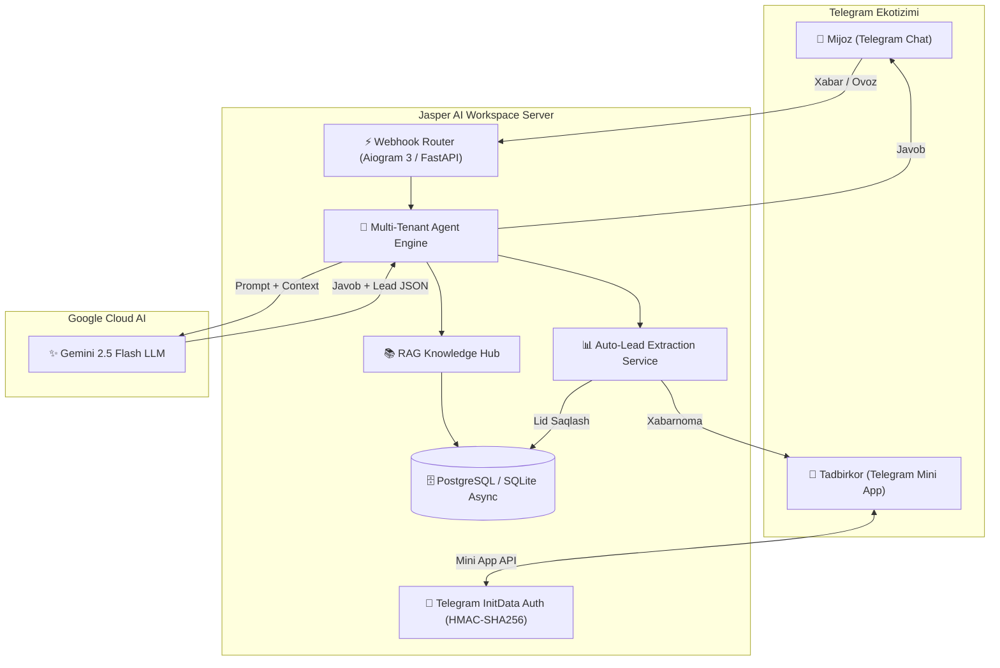

# 🚀 Jasper AI Workspace — Telegram AI Agent Studio (SaaS)

[](https://fastapi.tiangolo.com)
[](https://aiogram.dev)
[](https://react.dev)
[](https://tailwindcss.com)
[](https://ai.google.dev)
[](LICENSE)

> **Telegram Mini App (TMA)** orqali har qanday biznes (Klinikalar, Do'konlar, O'quv markazlari, Servislar) uchun **1 daqiqada shaxsiy AI Agent yaratish, bilimlar bazasini (RAG) yuklash va buyurtmalarni CRM-da boshqarish** imkonini beruvchi to'liq SaaS platforma.

---

## 🌟 Asosiy Imkoniyatlar (Features)

* 📱 **Telegram Mini App (TMA) & Web Dashboard:** Telegram ichidan chiqmasdan to'liq boshqaruv paneli (Dark/Native Telegram UI).
* 🤖 **No-Code AI Agent Constructor:** 1 daqiqada yangi bot yaratish, shablon tanlash va `@BotFather` tokenini ulash.
* 🩺 **Tayyor Soha Shablonlari (Templates):**
  * **Stomatologiya & Klinika:** Qabulga yozish, shifokorlar va xizmat narxlari.
  * **Kiyim & Do'kon:** Katalog, o'lchamlar, savdo va yetkazib berish.
  * **O'quv Markazi:** Kurslar, dars jadvallari va bepul sinov darslari.
  * **Usta Bozor & Servis:** Diagnostika va usta chaqirish dispetcheri.
* 🧠 **Gemini 2.5 Flash & RAG Bilimlar Bazasi:** Narxlar, xizmatlar va qoidalar asosida o'zbek tilida 100% tabiiy muloqot.
* 👥 **Avtomatik Lidlar & Buyurtmalar CRM:** AI suhbat davomida mijozning ismi, telefon raqami va buyurtmasini avtomatik ajratib oladi va biznes egasining Telegramiga darhol xabarnoma yuboradi.
* 👨‍💻 **Human Takeover (Operator rejimi):** Murakkab savollarda AI suhbatni operatorga uzatadi.

---

## 🏛️ Arxitektura (Architecture Diagram)



---

## 🚀 O'rnatish va Ishga Tushirish (Quick Start)

### 1. Repozitoriyani klonlash
```bash
git clone https://github.com/salomh46-rgb/jasper-ai-workspace.git
cd jasper-ai-workspace
```

### 2. Backend-ni ishga tushirish
```bash
cd backend
python -m venv venv
# Windows:
venv\Scripts\activate
# Linux/Mac:
source venv/bin/activate

pip install -r requirements.txt
cp .env.example .env
# .env ichiga GEMINI_API_KEY va MASTER_BOT_TOKEN kiriting

python main.py
```
Backend API: `http://localhost:8000`  
Swagger Hujjatlar: `http://localhost:8000/docs`

### 3. Frontend (Mini App)-ni ishga tushirish
```bash
cd ../frontend
npm install
npm run dev
```
Mini App Web Interface: `http://localhost:3000`

---

## 🐳 Docker orqali ishga tushirish (1 buyruq bilan)

```bash
docker compose up --build -d
```

---

## 👨‍💻 Muallif (Author)

* **Javohirbek Asqarov (Jasper)** — Full-Stack & AI Systems Architect
* Portfolio: [jasper.dev](https://github.com/salomh46-rgb)
